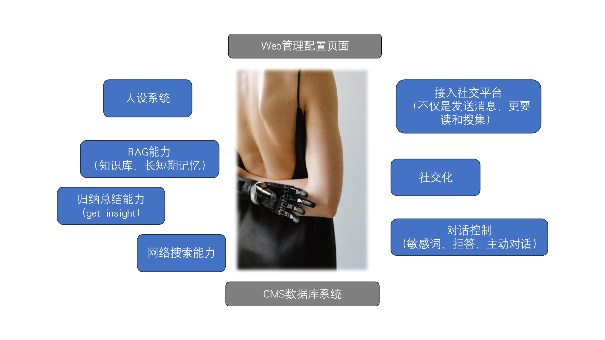

# What's Awada

awada是wiseflow团队计划中的 **“可在线自主学习的AI助理”** 开源项目。

[wiseflow](https://github.com/TeamWiseFlow/wiseflow)已经可以实现不断从网络（包括社交网络）中挖掘、提炼指定方向的知识，自然而然的，我们会想到将这种能力与AI Agent联合起来，这就是Awada项目的灵感！

# Join Us

awada的开发预计会在数月内启动，如果您也对此灵感迫不及待，下面是我们拟采用的一些技术栈。

- 个微接入（初期我们先仅考虑接入微信平台，通过微信群聊、指定的公众号进行学习，同时用户通过微信与bot进行对话）： https://github.com/jwping/wxbot
- 动态知识库（指定方向的知识挖掘、提炼与获取）： https://github.com/TeamWiseFlow/wiseflow
- Agent 框架， 这部分可选择的很多，如下是我们推荐的一些，您也可以选择您熟悉的框架或自写：
  - https://github.com/TeamWiseFlow/wiseflow 特别适合从大量文档中查找特定信息，自带角色管理
  - https://github.com/getzep/zep 特别擅长长期记忆管理与召回
  - https://github.com/embedchain 非常简洁的RAG方案，开箱即用
  - https://github.com/RUC-NLPIR/FlashRAG?tab=readme-ov-file 更加专业的RAG工具箱
  - https://github.com/filip-michalsky/SalesGPT 适合“目的域对话”的Agent，可以实现打电话哦
  - https://github.com/infiniflow/ragflow 完备的文档解析，独特的文档智能算法

---

**如果您愿意将您的开发贡献至本项目，我们将不胜感激！🚀💖**

所有为本项目贡献代码的开发者将自动成为 Wiseflow 主项目的贡献者 (contributor) 🎉

基于 Wiseflow 的所有商业合作项目，均会面向 `Wiseflow contributor & core-maintainer` 发出专案邀请，项目收益将直接归属专案组 💼💰。