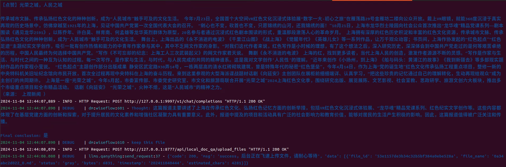
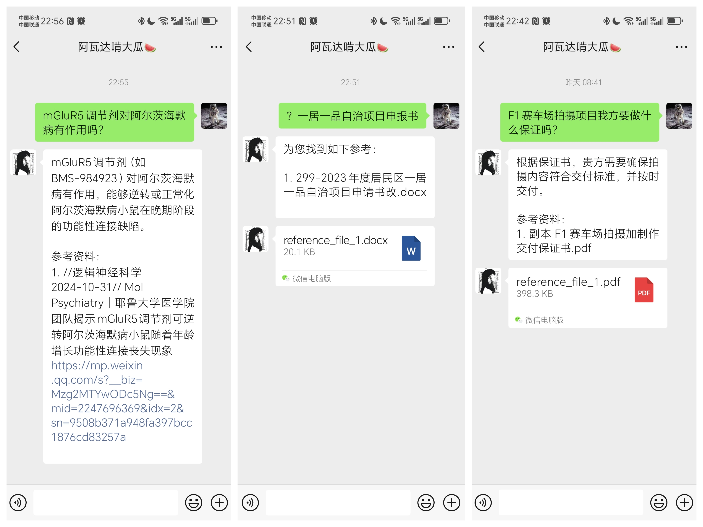
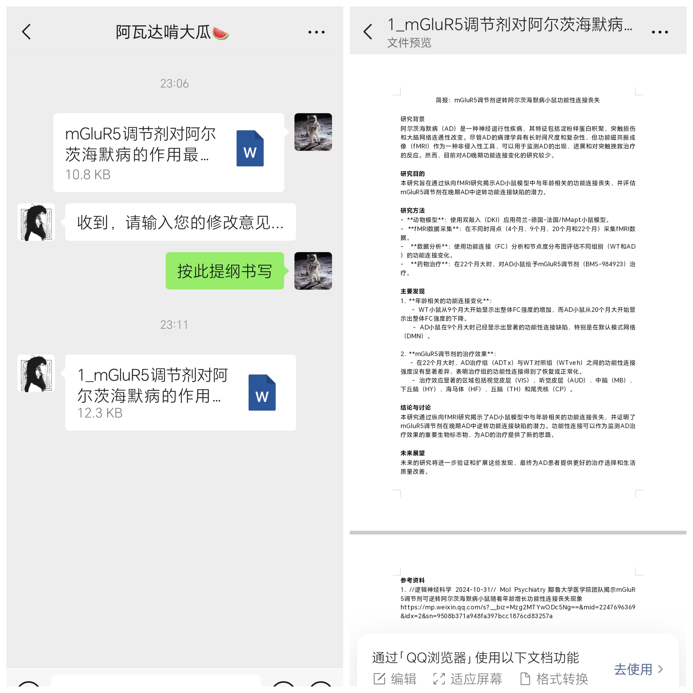
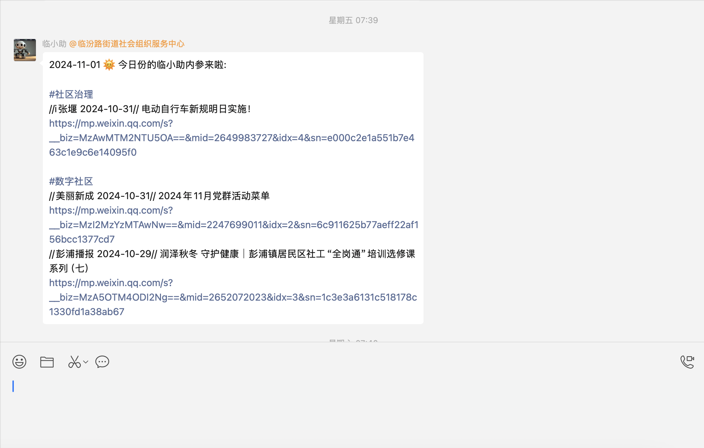
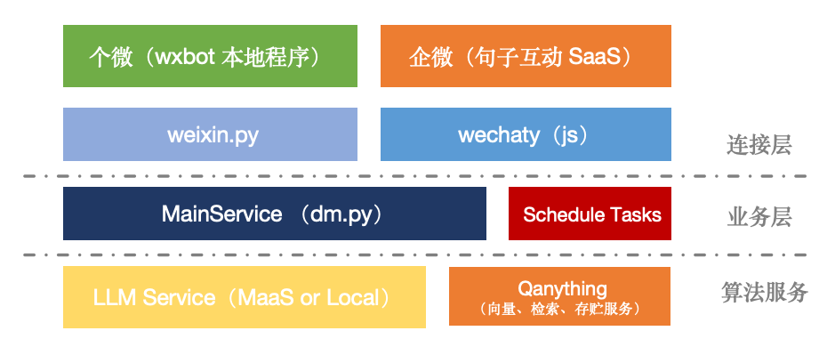
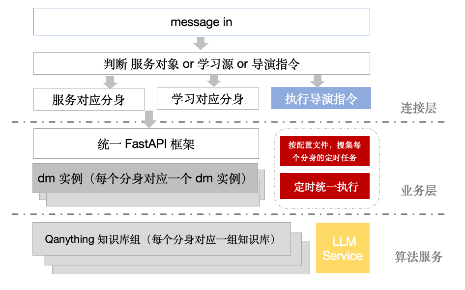

# Awada 1.x 来啦！

**Awada 0.x 版本已经停止维护，如您想继续使用基于 pocketbase 的新闻列表式界面（仅列表，无 RAG 相关功能），请下载 [V0.x 的 Release](https://github.com/TeamWiseFlow/awada/releases/tag/V0.x)** 

宣传视频：

[Youtube](https://youtu.be/H68tE4ZZNeU)  [Bilibili](https://www.bilibili.com/video/BV1fNDjY3Ewv/?share_source=copy_web&vd_source=5ad458dc9dae823257e82e48e0751e25)

# Awada - 团队知识助理智能体

Awada 是一个基于微信生态的团队知识助理智能体。它可以从群聊、公众号、网站等来源中进行在线自主学习（同时也接受自主文档上传），打造团队私域知识库，并为团队成员提供问答、资料查找以及写作（Word）服务。

## 功能与特性

- 🌐 同时支持个人微信（基于 [wxbot](https://github.com/jwping/wxbot)）和企业微信（基于[句子互动服务](https://juzibot.com/about-us))。

- 📚 支持来自群聊分享、公众号订阅、网站的在线自主学习（能力来自开源项目 [wiseflow](https://github.com/TeamWiseFlow/wiseflow)）。

- 📄 支持自主上传 `.md`, `.txt`, `.pdf`, `.jpg`, `.png`, `.jpeg`, `.docx`, `.xlsx`, `.pptx`, `.eml`, `.csv` 等格式的文档，并提供智能文档解析、动态存储、检索以及 RAG 能力（能力来自网易有道开源项目 [Qanything](https://github.com/netease-youdao/QAnything)）。

- 🤖 兼容任何 OpenAI 消息格式的 LLM 服务，无论是本地部署服务还是在线 MaaS 服务。

- 🔒 在使用本地 LLM 服务的情况下，可实现完全的本地私有化部署。

- 🧩 一个微信账号可以化身为多bot分身，分别配置以同时服务多个不同团队，且相互数据隔离。

- 🚀 全异步架构，高并发支持。

- 📰 除资料查找、问答、写作功能外，还提供基于私域知识库的每日简报功能。


## 目前已经实现的效果截图

### 在线自主学习



### 知识问答、资料查找



### 写作



### 每日简报




# 声明

**任何对本项目代码的使用、阅读、拷贝、修改、分发以及整合都被视为完全阅读并理解、接受如下各项声明，并且以上行为的所有后果均为使用者本人承担，与awada、wiseflow项目作者、贡献者、运营者无关！**

  - 1、微信软件的各项产权等归属腾讯公司；
  - 2、使用者应使用自有所有权的微信账号作为 bot 账号，并承担一切使用风险，包括但不限于账号封禁、信息泄露、信息安全以及腾讯公司可能的法律追责等；
  - 3、don't be evil。


# 部署流程（getting started）

## 1、硬件以及操作系统准备

### 硬件配置推荐

- CPU：8核+（推荐12代i5或同等性能及以上，我更喜欢 AMD）
- 内存：32GB+ （主要是 Qanything 特别吃内存）
- 硬盘：100GB+ 
- 网络要求不高，但需要有外网访问（正常使用无需独立 IP）
- 显卡 —— awada 项目（包括所依赖的 wxbot 和 Qanything） 并不需要显卡，但如果使用本地大模型服务，则需要搭配显卡，显存不低于24G

  （实际测试最低使用 qwen2.5-7b-8bit 量化版本模型可以实现基础的效果，不建议使用更低性能的 LLM）
- 操作系统 —— 推荐使用 ubuntu 22.04 LTS （windows 和 macOS 不是不行，只是会更加麻烦，如下教程全部基于 ubuntu 22.04 LTS）

## 2、LLM服务配置

### 2.1 使用在线的 MaaS 服务

推荐使用 Siliconflow 提供的在线 MaaS 服务，主流的开源模型基本都有，且价格在主流平台中基本是最便宜的，速度也相对较快，敏感词过滤也相对宽松。

使用 SF 提供的“Qwen/Qwen2.5-7B-Instruct”模型即可以实现基础的效果，SF平台目前对该款模型提供免费推理服务，如果并发比较大的话，可以使用 “Pro/Qwen/Qwen2.5-7B-Instruct” （￥0.35/1000 tokens）。

😄 如果您愿意，可以使用我的[siliconflow邀请链接](https://cloud.siliconflow.cn/i/WNLYbBpi)，你我都将获得2000万Tokens奖励 😄

注册好账号，并成功获得 API Key 后，更新 run_all.sh 文件中的如下两项：

```
LLM_API_BASE='https://api.siliconflow.cn/v1'
LLM_API_KEY='your_api_key'
```

### 2.2 使用由 AiHubMix 提供的gpt-4o API三方转发服务

针对有需求使用openai系列模型的用户，可以尝试第三方代理 **AiHubMix**，支持国内网络环境直连、支付宝充值（实际费率相当于官网86折）

🌹 欢迎使用如下邀请链接 [AiHubMix邀请链接](https://aihubmix.com?aff=Gp54) 注册 🌹

同样，注册好账号，并成功获得 API Key 后，更新 run_all.sh 文件中的如下两项：

```
LLM_API_BASE='https://aihubmix.com'
LLM_API_KEY='your_api_key'
```

**<span style="color:red;">注意：awada的 LLM wrapper实际上是基于 openai SDK 的，所以事实上任何使用 openai API消息格式的 LLM 服务都可以通过配置 run_all.sh 文件中的 `LLM_API_BASE` 和 `LLM_API_KEY` 来使用。</span>**

### 2.3 使用本地 LLM 服务

如需在本地部署 LLM 服务，推荐使用 [Xinference](https://github.com/xorbitsai/inference)，支持大多数主流开源模型，且内置 vLLM llama.cpp等高效推理引擎，支持苹果M系列芯片以及华为昇腾的 NPU，
支持一键下载模型文件，默认下载源为 modelscope，对国内网络环境友好。甚至也支持 lora 微调和加载，所以即便你有微调的需求，也可以使用。

**以下以 X86 架构的 Linux 系统为例，示意如何安装 Xinference 并启动本地 LLM 服务（其他架构的系统请参考[官方文档](https://inference.readthedocs.io/zh-cn/latest/getting_started/installation.html)）：**

```
conda create -n xinference python=3.10
conda activate xinference
pip install "xinference[vllm]"
```
（建议使用 conda 创建虚拟环境后再安装使用，另外我们这里只是用 vllm，如果想使用transformers或者 llama.cpp，请参考[官方文档](https://inference.readthedocs.io/zh-cn/latest/getting_started/installation.html)）

之后，启动本地 LLM 服务，可以直接使用本目录下的 start_local_llm.sh 脚本：

```
chmod +x start_local_llm.sh # 赋予执行权限，仅第一次需要
./start_local_llm.sh
```
（这个脚本使用 qwen2.5-7b-8bit 模型，全部启动后会占用至少17b 显存，如果需要使用其他模型，请修改脚本内容，第一次运行时会自动下载模型文件，耐心等待即可）

成功启动后，更新 run_all.sh 文件中的如下两项：

```
LLM_API_BASE='http://127.0.0.1:9997'
# LLM_API_KEY='' 本地服务无需这一项，请注释掉或删除
```

## 3、Qanything 配置

对于 linux/MacOS 用户，直接使用 Qanything 的 docker 镜像即可，windows 用户理论上也可以，但会有很多莫名其妙的问题，具体请参考 Qanything 的[官方文档](https://github.com/netease-youdao/QAnything)。

**以下以 Ubuntu 22.04 LTS 为例，示意如何安装 Qanything 的 docker 镜像：**

首先Qanything使用 Onnx 在 CPU 上运行 Ebedding 和 rerank 模型，比较吃内存，建议这里先调整下系统的 swap 文件大小：

```
sudo fallocate -l 16G /swapfile
sudo chmod 600 /swapfile
sudo mkswap /swapfile
sudo swapon /swapfile
```

docker的安装这里不再赘述，请参考[官方文档](https://docs.docker.com/get-docker/)。

装好docker 后首先配置 docker 的 daemon.json 文件（国内网络环境需要）

打开 /etc/docker/daemon.json 文件，添加如下内容：

```
{
  "registry-mirrors": ["https://registry.docker-cn.com","https://registry.dockermirror.com", "https://docker.nju.edu.cn", "http://hub-mirror.c.163.com", "https://mirror.baidubce.com", "https://ccr.ccs.tencentyun.com","https://dockerproxy.com", "http://mirrors.ustc.edu.cn/"]
}
```

之后在 ~ 下依次执行如下命令：

```
git clone https://github.com/netease-youdao/QAnything.git
cd QAnything
docker compose -f docker-compose-linux.yaml up -d
```
(Note) If the startup fails, you can try changing docker compose to docker-compose.

第一次使用会从网上拉取所需的 docker 镜像，耐心等待即可。

不要更改 Qanything 的服务端口等，这部分代码我是写死的，如果要更改的话，请修改 llms/qanything.py。

另外也不要更改 Qanything 代码仓的默认位置，如果你一定要这样做，记得更新 run_all.sh 文件中的如下项：

```
# export QANYTHING_LOCATION='/home/dsw'
```

额外说一句，Qanything 的 docker 配置文件和 entrypoint.sh 文件是我见过的开源项目中写的最好的，强烈推荐大家学习。

但是它的 logs 策略太啰嗦了，有能力的同学可以修改下 qanything_kernel/utils/custom_log.py 中 debug_log insert_log 为 WARNING 级别。默认的级别把报错信息都淹没了，虽然对于理解这个项目的运行机制很有帮助。

## 4、 wxbot 配置

awada 项目目前使用的 wxbot 方案来自大神jwping的 [wxbot](https://github.com/jwping/wxbot) 项目，感谢大神的无私分享！

- windows用户

  在这里下载对应版本微信客户端和wxbot-sidecar.exe：阿里网盘： https://www.aliyundrive.com/s/4eiNnE4hp4n 提取码: rt25

  然后命令行运行 

  `.\wxbot-sidecar.exe -p 8066`

  也可以参考 [这里](https://github.com/jwping/wxbot?tab=readme-ov-file#231%E9%85%8D%E7%BD%AE%E6%96%87%E4%BB%B6%E7%A4%BA%E4%BE%8B) 在 wxbot-sidecar.exe 同级目录构建配置文件，文件内容只需要：

`  {
      "addr": "0.0.0.0:8066"
  }`

  这样之后就可以直接双击 wxbot-sidecar.exe 启动，启动成功后会自动拉起微信 PC 客户端（如果未拉起，请手动打开微信 PC 客户端），此时使用作为 bot 账号的微信扫码登录即可。

- mac/linux 用户

  大神jwping很贴心的为我们准备了完整的 wine+微信客户端+wxbot-sidecar docker镜像，还上传到阿里云上了，所以使用起来也非常简单。

  具体可以参考 [这里](./About_WXbot.md)

- 更多有关wxbot的问题请参考原repo

  https://github.com/jwping/wxbot

  作者写的很详细，尤其是接口部分，希望大家能够顺手给作者打个赏。

**<span style="color:red;">声明：awada项目目前不涉及，也永远不会涉及任何对微信客户端的破解，逆向等，我们充分尊重并严格遵守微信的各项协议以及腾讯公司的知识产权，也请广大用户知悉。</span>**

## 4.1 企业微信配置（可选）

Awada 项目除支持个人微信外，也支持企业微信，企业微信接入方案来自国内 RPA 领导者 [句子互动](https://juzibot.com/about-us) 提供的 workpro 搭配 [wechaty](https://github.com/wechaty/wechaty) 框架。

具体请参考[wechaty/README.md](./wechaty/README.md)

注意：个微和企微配置一个即可，但是你也可以选择两个同时配置，分别提供学习、问答、写作等服务。

目前实际应用效果：句子互动提供的企业微信接入更加稳定，且自带语音转文字功能，但是因为企业微信的限制，无法关注公众号，得不到公众号消息（不影响从群聊中学习）。

## 5、启动awada程序

**<span style="color:orange;">都看到这了，还不给本项目点个star？↗</span>**

**建议使用conda创建虚拟环境**

```commandline
git clone git@github.com:TeamWiseFlow/awada.git
cd awada
conda create -n awada python=3.10
conda activate awada

pip install -r requirements.txt
chmod +x run_all.sh # 赋予执行权限，仅第一次需要
./run_all.sh
```
*注：最后一步也可以按需只启动主服务（run.sh），微信信息接口程序（run_weixin.sh）或者定时任务（run_tasks.sh）。但记得每一个脚本中都要配置环境变量，另外主服务是另两个的依赖，需要先启动。*

**至此部署过程已经完成，但在使用 awada 之前，请了解如下概念：**
- 导演（Director）：实际上就是微信 bot 的超级管理员，原初导演自然就是bot账号自身，如果要赋予其他用户该bot的导演权限，使用bot账号登录的手机微信端在任意群聊中发送"/promotion"指令，该群聊中的所有用户都会成为导演；

- 分身（Avatar）：一个 bot 可以有多个分身，以服务不同项目或团队，因为bot 账号是稀缺的，所以这个设计其实十分有必要。在 awada 里面，每个分身实际上就是一套预设配置，包括学习来源、问答模型、写作模型、每日简报生成策略等，所有分身的配置文件都存贮在 /avatars 文件夹中，请不要更改此文件夹位置，程序启动时会自动从这里扫描并读取所有合法的配置文件；

- 默认分身：每个分身的 id 其实就是创建该分身的群聊 id，但是会存在一个所谓的“默认分身”，它的 id 是空，对应的配置文件是 “default.json”，如果 avatar 文件夹内没有这个文件，程序启动时会自动创建，对于仅需要一个分身的应用场景（也就是所有用户都是用同一套学习源和知识库），那么默认分身就足够了，否则就需要创建新的分身；

- 创建分身：具有导演权限的账号（包括 bot 账号登录的手机微信客户端），可以在任意群聊中（当然要求 bot也在）使用"/start"指令为该群聊创建分身，但请注意，创建后并不会生效，你需要去/avatars 文件夹中找到对应的配置文件，并填入相关的配置（name 和 org 以及 chat_model 是必须的，其他都可以空着），之后重启程序才会生效，特别注意：默认分身（对应配置文件 default.json）也需要这样！

- 另外有一件事情需要牢记，bot 账号关注的所有公众号都会默认成为 default 的学习源，这无需编辑配置文件，这意味着让 awada从公众号自动学习很简单，只需要在 bot对应的微信手机客户端中关注公众号即可；但如果你希望将某个公众号配置为其他分身的学习源（或者把它从默认分身的学习源中移出），需要先获得该公众号的 id（gh_开头），然后手动编辑相应的配置文件，之后重启程序才会生效。

- 学习源（Source）：awada 项目中，学习源是指对应分身自主学习的来源，目前 awada 支持三类学习源：群聊（群聊内所有分享的卡片式文章）、公众号订阅和指定网络站点，公众号的配置见上一条，指定网络站点的配置需要编辑分身对应的 json 配置文件（具体加下）。而如果要添加群聊为某分身的学习源，使用导演账号在目标群聊中发送"/add_source 分身id"指令【注意之间的空格】。之后所有以卡片形式（公号文章等）分享到群聊中的内容都会被自动学习，如果是用企业微信的话，所有分享到群聊的文件也会被自动添加入知识库；

- 服务对象（Service）：awada 项目中，若要添加某群聊内成员为某分身的服务对象，使用导演账号在目标群聊中发送"/add_service 分身id"指令【注意之间的空格】。之后该群内所有成员都会成为该分身的服务对象。服务对象可以通过私聊（需要先主动添加 bot 为好友）或者群聊内@bot 的方式与 bot 对话，获得bot 的响应。如果某用户未被配置为任何分身的服务对象，那么该用户发送的消息将不会被 bot 响应。如果要更新某群聊的服务对象，请导演账号在群聊内发送"/refresh"指令，之后程序会重新获取群聊最新的成员列表并更新分身的服务对象配置。**请注意：用户主动退群，程序并不会自动去除其服务对象身份，请导演及时手动更新，以免造成团队知识泄露**。

- 时刻牢记，一个学习源（公号、群聊）或者一个服务对象（群以及群内成员）同一时间只能对应一个分身，但一个分身可以对应多个学习源和服务对象；

- 如果你为某个群聊创建了一个分身（导演账号在群聊中发送"/start"指令），那么该群聊中所有成员都会成为该分身的服务对象，同时该群也会成为分身的学习源。如果你想停止该分身，只需要导演账号在群聊中发送"/stop"指令即可。但请注意每次导演在群聊中发送"/stop"指令，程序也会同时停止它作为其他分身的学习源和服务对象（包括群里所有成员）；

- 任何时候，导演都可以向 bot账号发送"/list"指令，获取当前所有已生效的 bot 列表，包括分身 id 和名称，这很实用。

**分身的 config 文件各字段的含义如下：**

- "bot_id": "", 分身 id，程序自动生成，如果是默认分身，则 id 为空

- "bot_org": "", 分身对应的组织名称，必填，这是程序判断某内容是否值得学习的依据之一，同时程序回答的 prompt 中也会带上这个字段

- "bot_name": "", 分身名称，必填，一些默认回复的关键字段，同时程序回答的 prompt 中也会带上这个字段

- "learn_sources": [], 分身对应的学习源列表，一般来说用户无需手动配置，除非需要编辑公众号作为学习源

- "service_list": [], 分身对应的服务对象列表，正常情况下用户无需手动配置

- "chat_model": "", 分身对应的聊天模型，必填，请参考 LLM 服务

- "kbs": [], 分身对应的知识库列表，正常情况下用户无需手动配置

- "working_kb": "", 分身当前上传文件对应的知识库，正常情况下用户无需手动配置

- "greeting": "", 分身对应的问候语，如果为空，则分身会使用默认问候语

- "wiseflow_working_kb": "", 分身对应的在线自主学习正在使用的知识库，正常情况下用户无需手动配置

- "wiseflow_focus": [], 指定分身关注的在线学习领域，可以不配置，但建议配置，不然分身只会根据自己所在组织进行常识性判断

- "wiseflow_model": "", 分身对应的在线自主学习使用的模型，如果不配置，则使用分身对应的聊天模型

- "wiseflow_sites": [], 分身对应的在线自主学习关注的站点（例如 https://www.sq1996.com/news/ ），如果配置的话，会每天凌晨00：38自动扫描一遍站点的最新内容，并自动学习

- "topnews_shout": "", 分身对应的每日简报播报题目（比如“xx 群今日内参”），可有可无

- "top_news_items": {}, 分身对应的每日简报编辑大纲。这里不配置，则该分身不开启每日简报功能。
                    注意这里是字典，key 是栏目，value 是一个列表，对应该栏目的摘取关键词，如 "数字社区": ["数字技术在民生领域的应用","数字居委会","数字社工"...] 。

- "topnews_max": 5, 分身对应的每日简报每个栏目的最大条目数量。

- "topnews_scriber": [] 分身对应的每日简报发送对象, 需要填入 room_id 或者 wxid， 注意这里是列表格式，如果为空，则分身不开启每日简报功能（哪怕配置了top_news_items）

# 技术说明

注意：普通使用者无需关注本段内容，但如果想基于 awada 进行二次开发或者深入配置，如下内容可能对您更好的了解本项目有所帮助。

## 简明架构图



## 业务流程示意图



## 主服务出入参说明

- 服务消息处理接口： {'MAIN_SERVICE_ENDPOINT'}/dm;
- 学习消息处理接口： {'MAIN_SERVICE_ENDPOINT'}/feed;
- 热更新分身配置接口： {'MAIN_SERVICE_ENDPOINT'}/reassemble;

### 入参格式

- POST方法 `{“user_id”:str, “type”:”text”, 'content':Literal["text", "file"]，'addition': Optional[str]}，bot_id: Optional[str] = "default"`，type目前限定为text和file；
- type是text，content直接写内容，如果是file，content写对应的文件绝对路径；
- 多条输入，请多次请求，不要一次性传入多条输入；

更多细节可以访问 fastapi docs：{'MAIN_SERVICE_ENDPOINT'}/docs

### 出参格式

出参格式为：`{"flag": flag, "result": [{"type": str, "answer": str}]}`
   
注意：1、result可能有多个，为列表；

2、type 要么为text，要么为file，为file的话，后面的answer是文件的绝对路径。

flag说明

| flag 码 | 内容              | 
|--------|-----------------|
| -11    | LLM 错误/异常       |
| -4     | 语音asr失败（预留）         |
| -3     | qanything 数据库错误 | 
| -2     | qanything 查询错误  | 
| -1     | 入参格式错误           | 
| 0      | 正常返回            | 
| 1      | 呼叫导演            | 
| 2      | 功能暂不支持          | 
| 3      | bot未启动【端侧不同步】   | 
| 11     | 用户所处流程正常结束      |
| 21     | 生成了新的文件         |

# 限制与不足

awada 项目目前主要存在以下限制与不足：

- 1. 智能文档方面比较薄弱，所以更加适合从公众号、网站等在线源中提取知识，而不是从文档中。如果团队知识主要来自私有文件（比如 pdf、word等），不是很适合；
- 2. 不适合公开服务，比如客服等场景，200人以上的用户量也慎用；
- 3. wxbot 发送文件能力较弱，实测对于2M 以上的文件可能会导致发送不成功且会阻塞后续消息发送，表现为 bot 无反馈。但因为程序整体为异步架构，所以此时不影响后面消息的接收和处理；
- 4. wxbot目前没有收文件的能力，所以无法直接通过个微进行文档上传，也用不了写作功能，这两个功能要求使用企业微信，但企业微信不支持公众号关注；
- 5. 无论是 wxbot 还是句子互动提供的workpro，都非完全开源软件，本质上是黑盒，数据安全方面请自行评估并承担所有可能的风险。

# 升级计划

- 1. 跟随 wiseflow 12月升级版本，同步更新最新的通用页面提取器，实现对各类静态页面更优的提取效果；
- 2. 寻找并整合更加理想的个微接入方案（欢迎大家推荐）；
- 3. 更新RAG方案，增强智能文档处理能力并尽可能降低系统要求；
- 4. 引入多模态 RAG 方案，各项功能都升级为多模态能力；
- 5. 提供更丰富的接入方式，比如支持钉钉、飞书等……

awada 项目承诺永远开源免费，热忱欢迎大家贡献代码，一起完善。

# 致谢

awada 项目基于如下开源项目，特此致谢：

- [wiseflow](https://github.com/TeamWiseFlow/wiseflow) —— an agile information mining tool that extracts concise messages from various sources 
- [qanything](https://github.com/netease-youdao/QAnything) - Question and Answer based on Anything.
- [wxbot](https://github.com/jwping/wxbot) - WeChatRobot
- [wechaty](https://github.com/wechaty/wechaty) - Conversational RPA SDK for Chatbot Makers
- [xinference](https://github.com/xorbitsai/inference) - Replace OpenAI GPT with another LLM in your app by changing a single line of code

# Citation

如果您在相关工作中参考或引用了本项目的部分或全部，请注明如下信息：

```
Author：Awada Team
https://github.com/TeamWiseFlow/awada
Licensed under Apache2.0
```

意见与反馈，请在 [Github Issue](https://github.com/TeamWiseFlow/awada/issues) 中提出。
合作与咨询，请发邮件：zm.zhao@foxmail.com 。