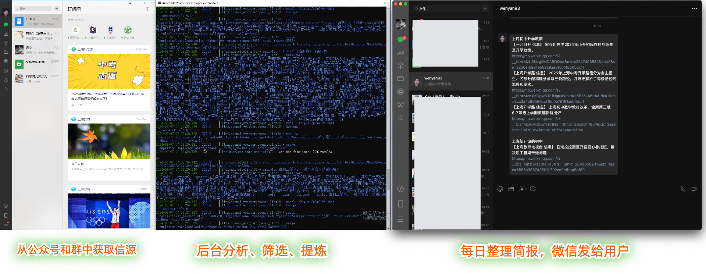
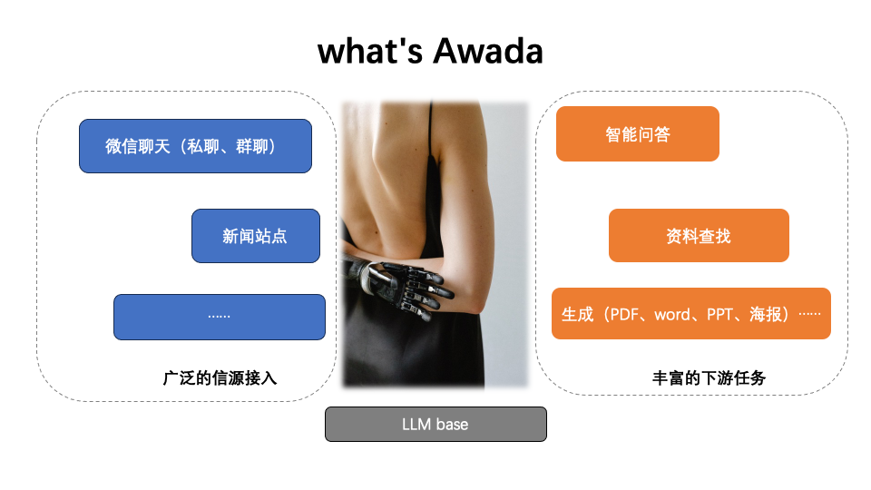

# Awada 1.x 来啦！

**Awada 0.x 版本已经停止维护，如您想继续使用基于 pocketbase 的新闻列表式界面（仅列表，无 RAG 相关功能），请下载 [V0.x 的 Release](https://github.com/TeamWiseFlow/awada/releases/tag/V0.x)** 

# Awada - 团队内知识助理智能体

Awada 是一个基于微信生态的团队内知识助理智能体。它可以从群聊、公众号、网站等来源中进行在线自主学习（同时也接受自主文档上传），打造团队私域知识库，并为团队成员提供问答、资料查找以及写作（Word）服务。

## 功能与特性

- 🌐 **不同类型微信账号的支持**  
  同时支持个人微信（基于 [wxbot](https://github.com/jwping/wxbot)）和企业微信（基于[句子互动服务](https://juzibot.com/about-us))。


- 📚 **在线自主学习**  )
  支持来自公众号文章、网站的在线自主学习（能力来自开源项目 [wiseflow](https://github.com/TeamWiseFlow/wiseflow)）。


- 📄 **文档上传与解析**  
  支持团队自主上传 `.md`, `.txt`, `.pdf`, `.jpg`, `.png`, `.jpeg`, `.docx`, `.xlsx`, `.pptx`, `.eml`, `.csv` 等格式的文档，并提供智能文档解析、动态存储、检索以及 RAG 能力（能力来自网易有道开源项目 [Qanything](https://github.com/netease-youdao/QAnything)）。


- 🤖 **LLM 服务支持**  
  支持任何 OpenAI 消息格式的 LLM 服务，无论是本地部署服务还是在线 MaaS 服务。


- 🔒 **本地私有化部署**  
  在使用本地 LLM 服务的情况下，可实现完全的本地私有化部署。


- 🧩 **多分身设计**  
  一个 bot 账号可以服务多个不同团队，并单独进行个性化配置，且相互数据隔离。


- 🚀 **全异步架构**  
  全异步架构，高并发支持。


- 📰 **每日简报功能**  
  除资料查找、问答、写作功能外，还提供基于私域知识库的每日简报功能。


## 目前已经实现的效果截图




# 声明

**任何对本项目代码的使用、阅读、拷贝、修改、分发以及整合都被视为完全阅读并理解、接受如下各项声明，并且以上行为的所有后果均为使用者本人承担，与awada、wiseflow项目作者、贡献者、运营者无关！**

  - 1、awada为开源学习项目，仅限个人用户技术交流，请勿用作任何商业用途或实际生产用途；
  - 2、微信接入方案来自开源项目 [wxbot](https://github.com/jwping/wxbot)， 不能保证稳定性与安全性（目前没有安全稳定的个微接入方案），请风险自担（**建议使用微信小号接入，接入前关闭所有支付相关和服务功能**）；
  - 3、微信软件的各项产权等归属腾讯公司；
  - 4、再说一遍，风险自担，责任自担，与我无关；
  - 5、don't be evil。

# 操作说明（实现上图的效果）

## 1、启动 wiseflow （目前整个分析后端和数据库都依赖wiseflow，awada不会另外维护这部分代码）

具体见 [wiseflow README_CN.md](https://github.com/TeamWiseFlow/wiseflow/blob/master/README_CN.md)

## 2、 启动 wxbot （微信机器人部分依赖wxbot，awada永远不会维护这部分代码）

首先感谢wxbot项目作者 **jwping** ！

- windows用户

  在这里下载对应版本微信客户端和wxbot-sidecar.exe：阿里网盘： https://www.aliyundrive.com/s/4eiNnE4hp4n 提取码: rt25

  然后命令行运行 

  `.\wxbot-sidecar.exe -p 8066`

  也可以参考 https://github.com/jwping/wxbot?tab=readme-ov-file#231%E9%85%8D%E7%BD%AE%E6%96%87%E4%BB%B6%E7%A4%BA%E4%BE%8B
  在 wxbot-sidecar.exe 同级目录构建配置文件，文件内容只需要：

`  {
      "addr": "0.0.0.0:8066"
  }`

  这样之后就可以直接双击 wxbot-sidecar.exe 启动。

- mac/linux 用户

  大神jwping很贴心的为我们准备了完整的 wine+微信客户端+wxbot-sidecar docker镜像，还上传到阿里云上了，所以使用起来也非常简单。

  具体可以参考 [这里](./About_WXbot.md)

- 更多有关wxbot的问题请参考原repo

  https://github.com/jwping/wxbot

  作者写的很详细，尤其是接口部分，希望大家能够顺手给作者打个赏。【Awada项目完全技术交流定位，无需任何打赏和回馈】

## 3、启动awada程序

**建议使用conda创建虚拟环境**

```commandline
git clone git@github.com:TeamWiseFlow/awada.git
cd awada
conda create -n awada python=3.10
conda activate awada

pip install -r requirements.txt
python dm.py
python tasks.py
```

dm.py 是消息接收和处理脚本；

tasks.py 是每日简报生成和发送脚本，可以打开代码按需定制【发送时间、发送人列表以及消息格式等】，如无需要也可以不启动。

# Join Us

长期来看，awada有希望凭借**在线自主学习能力**成为**最贴心的私人助理**或者是**精通某个领域的专家顾问**，不过这还有很多功能有待开发，如下是一个构思图。



当我最开始做这张图的时候，着实兴奋了好一阵，但无奈个人的时间精力总是有限，后续我还是会把主要精力花在wiseflow的升级和维护中（即图中左半部分），而awada的Agent部分（图中右半部分）就留给开源社区的群策群力吧！

_如下是我前期考察过的一些非常优秀的项目，其实很适合借鉴整合：_
  - https://github.com/danswer-ai/danswer 特别适合从大量文档中查找特定信息，自带角色管理
  - https://github.com/getzep/zep 特别擅长长期记忆管理与召回
  - https://github.com/embedchain 非常简洁的RAG方案，开箱即用
  - https://github.com/RUC-NLPIR/FlashRAG?tab=readme-ov-file 更加专业的RAG工具箱
  - https://github.com/filip-michalsky/SalesGPT 适合“目的域对话”的Agent，可以实现打电话哦
  - https://github.com/infiniflow/ragflow 完备的文档解析，独特的文档智能算法

Agent部分的代码建议统一放在 [./agents](./agents) 文件夹中，其实目前的topnews和tasks也应该整合到这里。

**如果您愿意将您的开发贡献至本项目，我们将不胜感激！**🚀💖

# Citation

如果您在相关工作中参考或引用了本项目的部分或全部，请注明如下信息：

```
Author：Awada Team
https://github.com/TeamWiseFlow/awada
Licensed under Apache2.0
```
